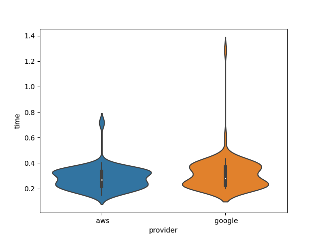

# Hybrid Cloud Analytics with an example of Natural Language Translation.

Gregor von Laszewski (1), Myles Soladine (2)

 1. University of Virginia, laszewski@gmail.com
 2. Indiana University, Luddy School of Informatics, Computing and Engineering, mysoladine@gmail.com


## Abstract

COMMENT FORM GREGOR: THIS IS NOT WHAT THIS PAPER IS ABOUT:

Natural Language operators are everywhere in technology. They aim
to relate machine learning and human needs for the better good of
a business practice or information system. These systems
are operated by large cloud providers such as Google, IBM Watson
and Amazon. The goal of this research is to highlight what services
these cloud providers offer. Taking what these operators can do 
considering machine limitations, and creating a 
Natural Language Translation example. This example will then be 
implemented into a catalog called cloudmesh. also included an example using 
catalog would then be able for reuse for data scientists, information
analysts, and other researchers. The design of this study is to
take a deeper look into the composition of language translation,
and language conversion. Cloud providers in modern day were our main focus, ex. 
Google, Amazon. Our findings highlight the larger ability to use these
services in other forms of reproduction. Subsequently, starting a conversation for how these
services can benefit common business practices is a very important
subject in our research and should be continued past the initial 
research stages.

## Introduction

Hybrid cloud analytics have many practical uses in the world. 
Cloud providers offer apis for machine learning, Database 
configuration, and a multitude of other services. 
This research specialized in Natural Language Translation. 
This is a good example of how these cloud providers work because 
the learning curve for getting started is small. The services created 
in this project can be  easily replicated and are stated in 
the [Reference](#reference). For this research we focused on the Natural 
Language Translation API Google and Amazon Web Services provide.
Amazon Web Services and differ greatly. Each service has an online console 
interface
that is very different from each other. Furthermore, each service has an 
API key creation
that requires account creation, permission settings, and credential validation.
We have found that each service is uniform with their requirements. This will be highlighted
in the requirements section.
Each service is different therefore it is hard to tell which service is easier to use.
This will be highlighted in our Result section as there are pros and cons to the
use of each service.

## Requirements

When starting to use Google and AWS as cloud providers there are steps that must be
completed in order to use these services. Google and AWS both require billing information
to get started with their service. Not to worry, each provider offers a free $300 credit
for all new users. However, it is imperative that you insert good billing information to get started.


Another requirement is the subpackages for Google and AWS.
In this project there is a comprehensive package installation found at [Requirements](requirements.txt).
This is where you use ```pip install -r requirements.txt``` in the command line.

## Survey of Technologies

### Cloud providers

What services do they offer

Cloud providers are large development driven companies
that provide endpoints or api keys for recreation on a 
different platform. These main providers are IBM Watson, 
Microsoft Azure, Google Cloud, and Amazon Web Services.
Here we have focused on the machine capabilites of each endpoint.
The functionality of each service is listed below.

| Title of Service            | Provider | Billing? |  Region required? | Endpoint required? |Amount of free credit. |
|-----------------------------|:-------:|---------:|------------------:|-------------------:|-------------------:|
| Amazon Comphrehend          |   AWS   |      Yes |               Yes |                yes |Region required? |
| Oracle Cloud Language       |  Oracle |      Yes |               Yes |                yes |Region required? |
| Azure Language Translation? |  Azure  |      Yes |               Yes |                yes |Region required? |


Create table with with comparision.

## Architecture

## Implementation

## Result

what results have been explained


| Title of Service                                 | Provider | Billing? | Region required? |
|--------------------------------------------------|:--------:|---------:| ---------:|
| Account creation required under AWS cloudservices|   [x]    |          | Region required? |
| billing required?                                |   [x]    |          | Region required? |
| Region required?                                 |   [x]    |          | Region required? |

We have executed... Results are displayed in Figure 1.



Figure 1: Here is shown a violin plot of a description

## Conlusion

## Acknowledgement 

TBD

## Reference

1. [Documentation to get started with AWS Translate Service](README-aws.md)
2. [Natural Language Translation Example using Google Services](README-google.md)
BIBTEX


