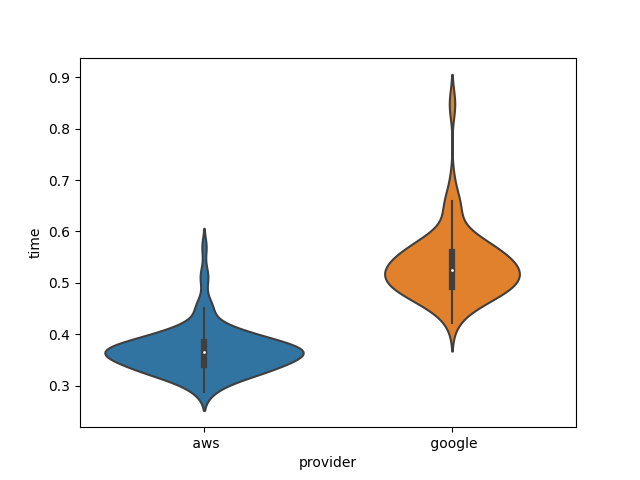

# title

Gregor von Laszewski (1), Myles Soladine (2)

 1. University of Virginia, laszewski@gmail.com
 2. Indiana University, ...

## Abstract

TBD

## Introduction

## Requirements

## Survey of Technologies

### Cloud providers

What services do they offer

Create table with with comparision.

## Architecture

## Implementation

## Result

what results have been explained

We have executed... Results are displayed in Figure 1.

Figure 1: Here is shown a violin plot of a description

## Conlusion

## Acknowledgement 

TBD

## Reference

1. [Documentation to get started with AWS Translate Service](README-aws.md)
2. [Natural Language Translation Example using Google Services](README-google.md)
BIBTEX

