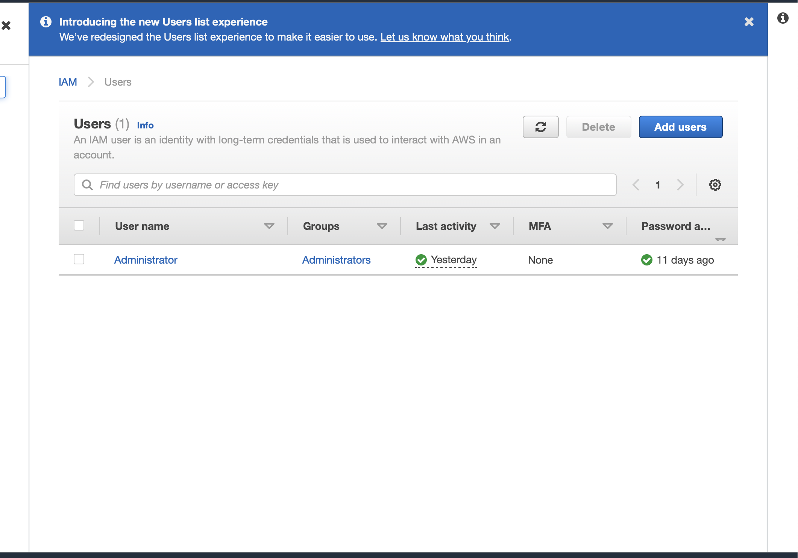
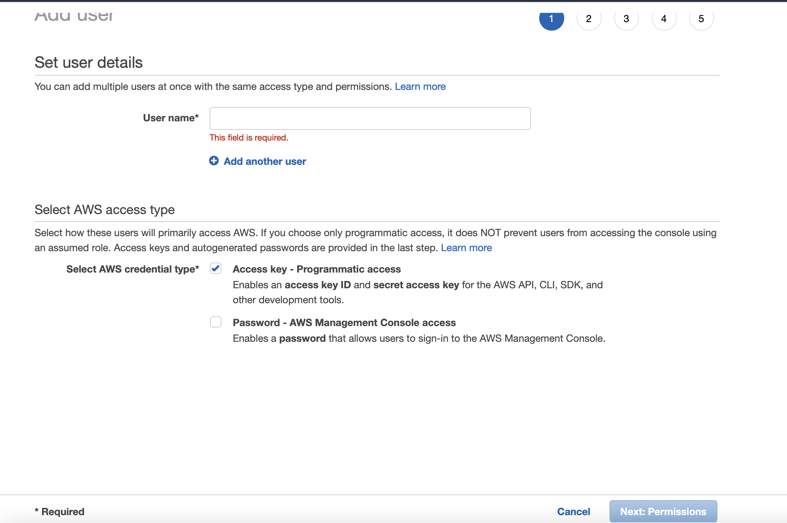
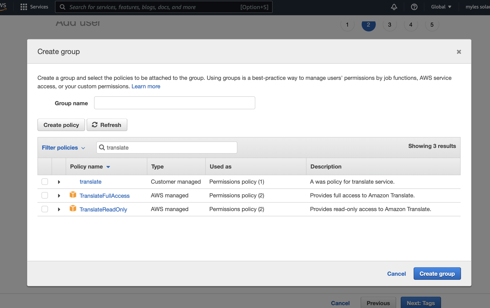
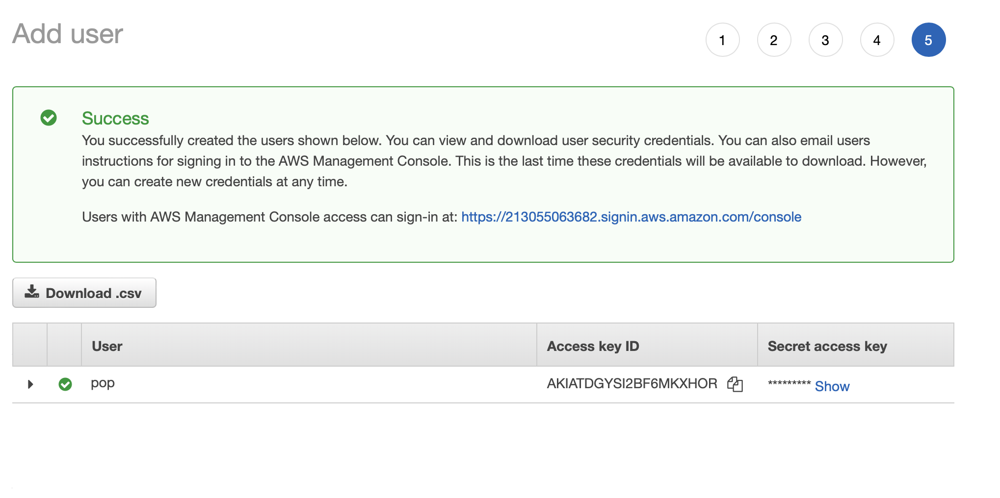

# Documentation to get started with AWS Translate Service

AWS offers there a Text-translation service. A comorehensive manual 
on how to use it and sign up for this service is located at 

* <https://docs.aws.amazon.com/translate/latest/dg/setting-up.html>

In this documentation we provide a summary of steps that give you 
quickly access to the service. 

## Step 1: Creating a new iam user account on aws.

To use AWS-translate you need to create an account via the IAM user 
account application form:

* <https://portal.aws.amazon.com/billing/signup#/start/email>

Like many other cloud services you will have to enable billing in
order to use this service. Sign up for an iam user account and make 
the username name `aminuser`:


### Step 2: Creating a access key ID and secret ID

Once you have signed up with an IAM user account and have implemented
billing you can navigate to the aws console:

* <https://us-east-1.console.aws.amazon.com/iamv2/home?region=us-east-1#/home>


Here you can access secret keys and set permissions.
At the top of this page search for text translate.

From here we are going to create an access key ID and a secret key id.
This step is trivial to the success of a translation example

From the IAM dashboard page select the 'Users' option under IAM
Resources

After clicking users you can create a user to run credentials.

From here click add user.



You will be required to add a name.

Make sure you check the box for Access Key and go to the next step.




Here is a section to add permissions for your IAM account User Group.
From here search translate and check the boxes for `Translate`, and
`TranslateFullAccess`.

You can then click create group.



Next step is tags. this step is meant for users that want to give
optional tags to their project.

You can skip this as it is irrelevant to this project.

After reaching this page you will want to confirm the creation of your
user group.


From here you will be sent to a screen where you can download
credentials




download these credentials as a csv file for later use.

Open up a terminal window to install aws on the command
line.

Run these commands:

Start of a virtual enviorment

```bash
$ python3.10 -m venv ~/ENV3
$ source ~/ENV3/bin/activate
$ curl "https://awscli.amazonaws.com/AWSCLIV2.pkg" -o "AWSCLIV2.pkg"
$ sudo installer -pkg ./AWSCLIV2.pkg -target /
$ which aws
$ aws --version
$ aws configure
```

Here they will give you an output like

```AWS Access Key ID [****************4FCA]:```

You will open the file you downloaded from the user creation
earlier.  You will see your personalized access key in that file. You
will copy that key and paste it into the terminal.

You then will add your secret key which is also in the csv you
downloaded.

```AWS Secret Access Key [****************/kIg]: ```

You then will add the region

```Default region name [eu-west-1]: ``` 

The region depends on which one is closest to you. For me, it is
`eu-west-1`.

Then you will insert json

```Default output format [json]:``` 

Here It is recommended to insert `json`:

From here you can get started working in the command line found here:
[CLI Start](/Users/mysol/cm/cloudmesh-nlp/documentation/README-cli.md)


