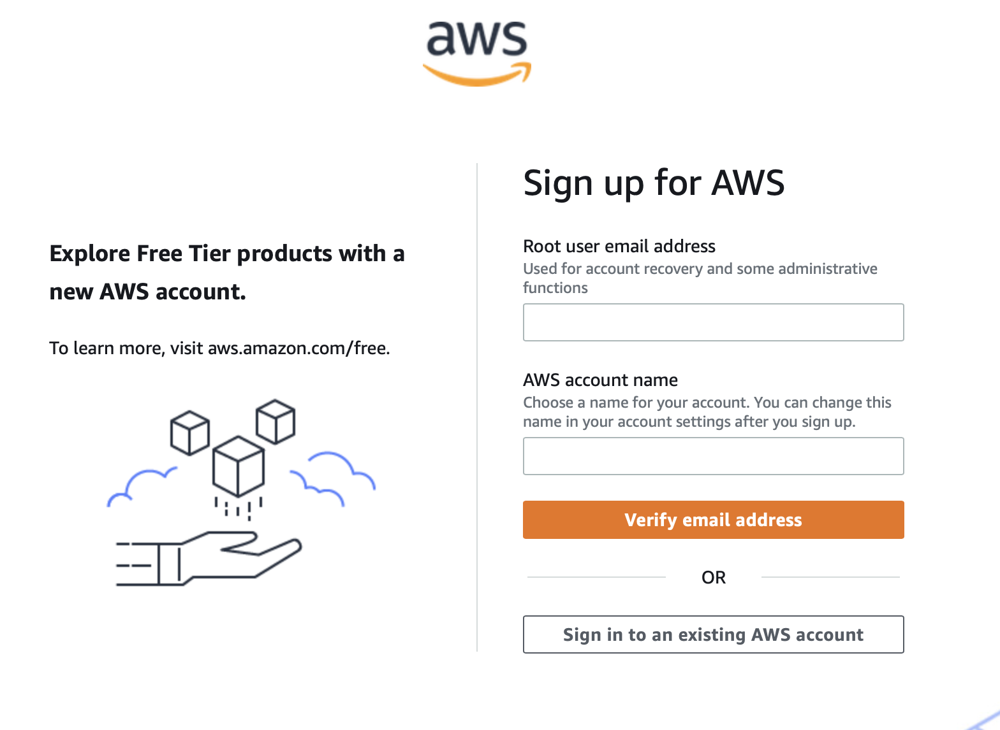
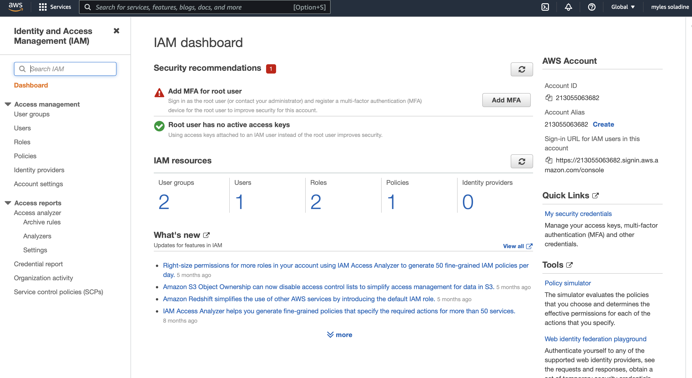

# Documentation to get started with AWS translate.
AWS offers there own Text-translation service to get started navigate to: https://docs.aws.amazon.com/translate/latest/dg/setting-up.html

### Step 1: creating a new iam user account on aws.
Here is the link to aws sign up for iam user account:
https://portal.aws.amazon.com/billing/signup#/start/email

like many other cloud services you will have to enable billing in order to use this service.

Sign up for an iam user account and make the username name "aminuser"

### Step 2: Creating a access key ID and secret ID

Once you have signed up with an iam user account and have implemented billing you can navigate to the aws console. Here:
https://us-east-1.console.aws.amazon.com/iamv2/home?region=us-east-1#/home

Here you can access secret keys and set permissions.
At the top of this page search for text translate.

From here we are going to create an access key ID and a secret key id.
This step is trivial to the success of a translation example

from this page select the user option under Iam Resources

after 
