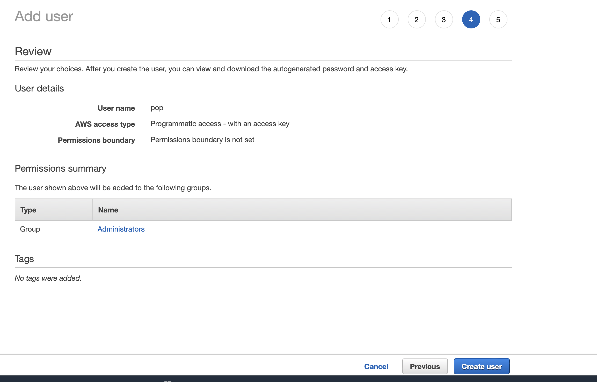

# Documentation to get started with AWS Translate Service

AWS offers there own Text-translation service to get started navigate to: https://docs.aws.amazon.com/translate/latest/dg/setting-up.html

### Step 1: creating a new iam user account on aws.
Here is the link to aws sign up for iam user account:
https://portal.aws.amazon.com/billing/signup#/start/email

like many other cloud services you will have to enable billing in order to use this service.


Sign up for an iam user account and make the username name "aminuser"

### Step 2: Creating a access key ID and secret ID

Once you have signed up with an iam user account and have implemented billing you can navigate to the aws console. Here:
https://us-east-1.console.aws.amazon.com/iamv2/home?region=us-east-1#/home


Here you can access secret keys and set permissions.
At the top of this page search for text translate.

From here we are going to create an access key ID and a secret key id.
This step is trivial to the success of a translation example

From the IAM dashboard page select the 'Users' option under IAM Resources

After clicking users you can create a user to run credentials.

From here click add user.


You will be required to add a name.

Make sure you check the box for Access Key and go to the next step.


Here is a section to add permissions for your IAM account User Group.
From here search translate and check the boxes for Translate, and TranslateFullAccess.

You can then click create group.


Next step is tags. this step is meant for users that want to 
give optional tags to their project.

You can skip this as it is irrelevant to this project.

After reaching this page you will want to confirm the creation of your user group.



From here you will be sent to a screen where you can download credentials


download these credentials as a csv file for later use.

From here open up a terminal window to install aws on the command line.

Run these commands:

installation of aws packages.
```
curl "https://awscli.amazonaws.com/AWSCLIV2.pkg" -o "AWSCLIV2.pkg"
```
```
sudo installer -pkg ./AWSCLIV2.pkg -target /
```
```
which aws

aws --version
```

Next: After downloading aws packages you need to run this script in terminal
```commandline
aws configure
```
Here they will give you an output like

```AWS Access Key ID [****************4FCA]:```

here you will open the file you downloaded from the user creation earlier.
you will see your personalized access key in there. You will copy that key and paste it into the terminal here

You then will add your secret key which is also in the csv you downloaded.

```AWS Secret Access Key [****************/kIg]: ```

You then will add the region 

```Default region name [eu-west-1]: ``` 

Here It is recommended to insert 'eu-east-1'

Then you will insert json
```Default output format [json]:``` 

from here you can use translate examples on the command line.


