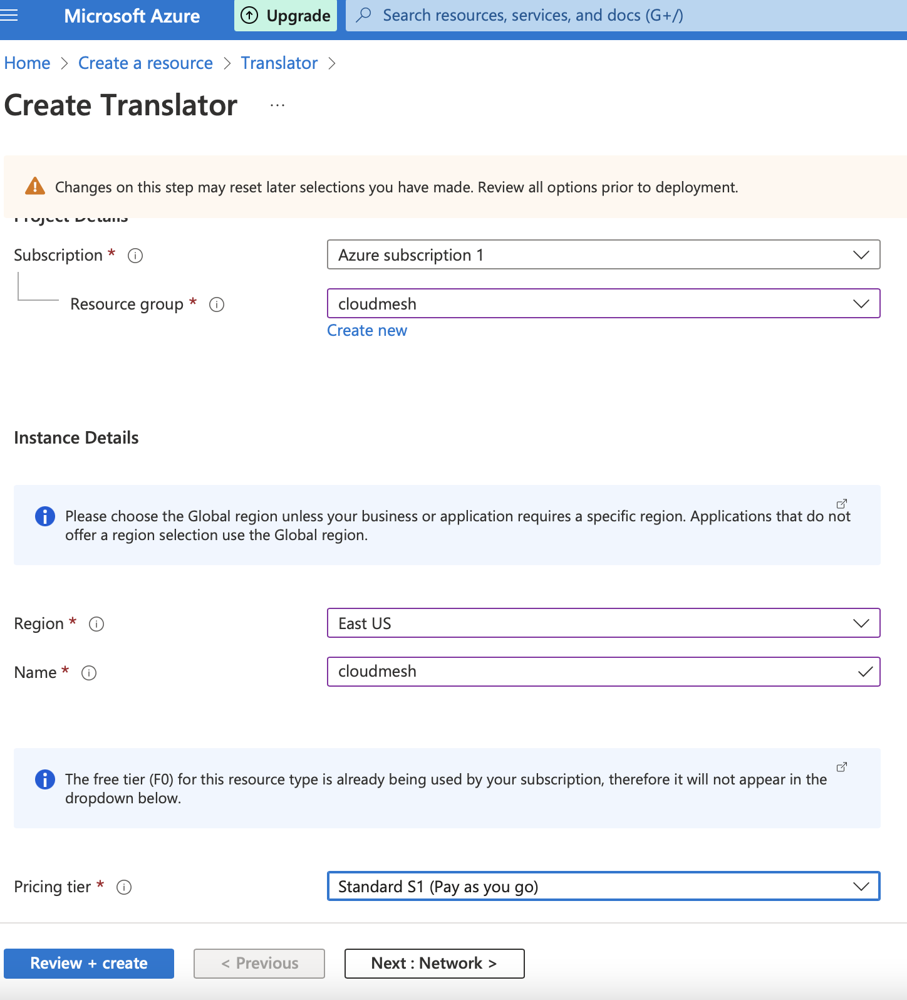

## Documentation to get started with Azure Translate.

### Step 1: account creation
Here are steps to get started with the azure translate example in cloudmesh nlp.

navigate tot his link to sign uo with an azure account:https://azure.microsoft.com/en-us/free/cognitive-services/


After selecting this link you will follow the isntructions to set up a microsoft azure account. This requires billing.


 furthermore, after setting up an account with an email and billing you will be prompted to the console screen.


from here, you will click the top left link to go to the console.

You can either type translators in the search bar or follow this link:
https://portal.azure.com/#blade/Microsoft_Azure_ProjectOxford/CognitiveServicesHub/TextTranslation


From here you will click the create translator button.

This is what the Create Translator console will look like. 
Here there is a form for creating an endpoint for this translate service


This what the form should look like filled
out with the proper applied information. 



Resource groups are mostly irrelevant they are for bigger scaled projects
where multiple people are working. 
Title this something for the project since it is required for an endpoint.

After this scroll down and hit 'Create'


This is what the screen looks like after deployment.
Download the deployment details and click next steps.


## Installing and Starting Azure Translate through the command line

### Step 2: installing using Homebrew

Homebrew is by far the easiest way of installing Microsoft Azure. 

On the command line use the command

```
$ /bin/bash -c "$(curl -fsSL https://raw.githubusercontent.com/Homebrew/install/HEAD/install.sh)"
```
This will install Homebrew and all of its packages.
Now run the command below to install azure cli.

```commandline
$ brew update && brew install azure-cli
```

This installs the azure command line interface in the current directory.

From here we need to login to azure and its console that we created above.

start with 
```
$ az login
```

This command will prompt you with a new window page with a microsoft login.


From here choose your proper login that was created with azure translate.

you will see a success in login. 


information about your account will be displayed on the command line.

```commandline
[
  {
    "cloudName": "AzureCloud",
    "homeTenantId": "1113be34-aed1-4d00-ab4b-cdd02510be91",
    "id": "d0ff5454-d152-4d11-8fe8-58a0c08581f1",
    "isDefault": true,
    "managedByTenants": [],
    "name": "Azure subscription 1",
    "state": "Enabled",
    "tenantId": "1113be34-aed1-4d00-ab4b-cdd02510be91",
    "user": {
      "name": "mysoladi@iu.edu",
      "type": "user"
    }
  }
]
```

Use the command line to create a translate example using azure:

```commandline

curl -X POST "https://api.cognitive.microsofttranslator.com/translate?api-version=3.0&to=es" \
     -H "Ocp-Apim-Subscription-Key:<secret key>" \
     -H "Ocp-Apim-Subscription-Region:<region>" \
     -H "Content-Type: application/json" \
     -d "[{'Text':'Hello, what is your father?'}]"
```

For ``secret key `` you must insert the endpoint key that was 
generated in the previous account creation
(same as key 1 in the figure below).


Region is also highlighted in this form.

This will return 
```commandline
[{"detectedLanguage":{"language":"en","score":1.0},"translations":[{"text":"Hola, ¿cuál es tu padre?","to":"es"}]}]%  
```

Using azure in a program sample found 
[here](/Users/mysol/cm/cloudmesh-nlp/cloudmesh/nlp/provider/azure/translatesample2.py)
you can use the endpoints, region, and secret key found in account
creation to return a text translation.


