# Natural Language Translation Example using Google Service

In order to get started using google translate there are steps for
setup.


### How to get started using this api.

Navigate to the link

* <https://cloud.google.com>

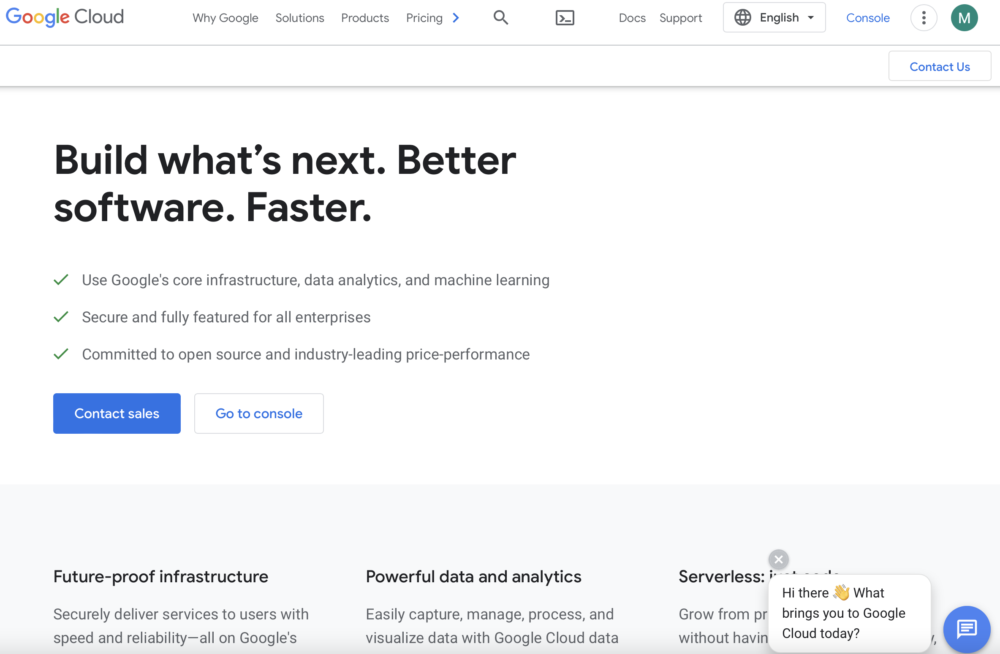

This is the homepage for Google cloud. Will need to activate your
console with a Google account and billing.

Google offers a free trial of up to $300 of language translation to
test. After activation of account, you will want to click console in
the top right.

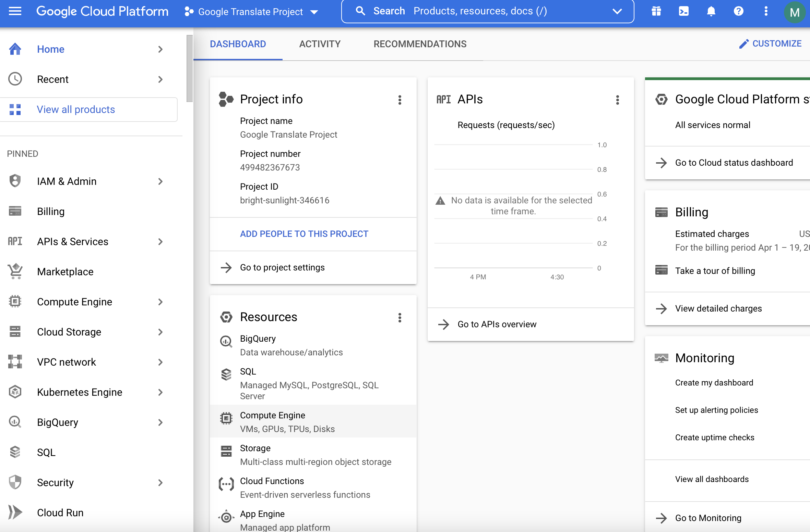

Here is the console for all google projects.  The next step is to make
a new project by selecting the dropdown at the top left.

The project creation page will look like this:

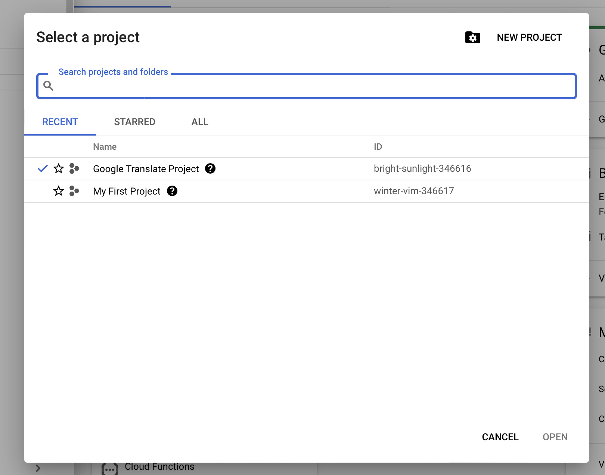

Then, click create new project.

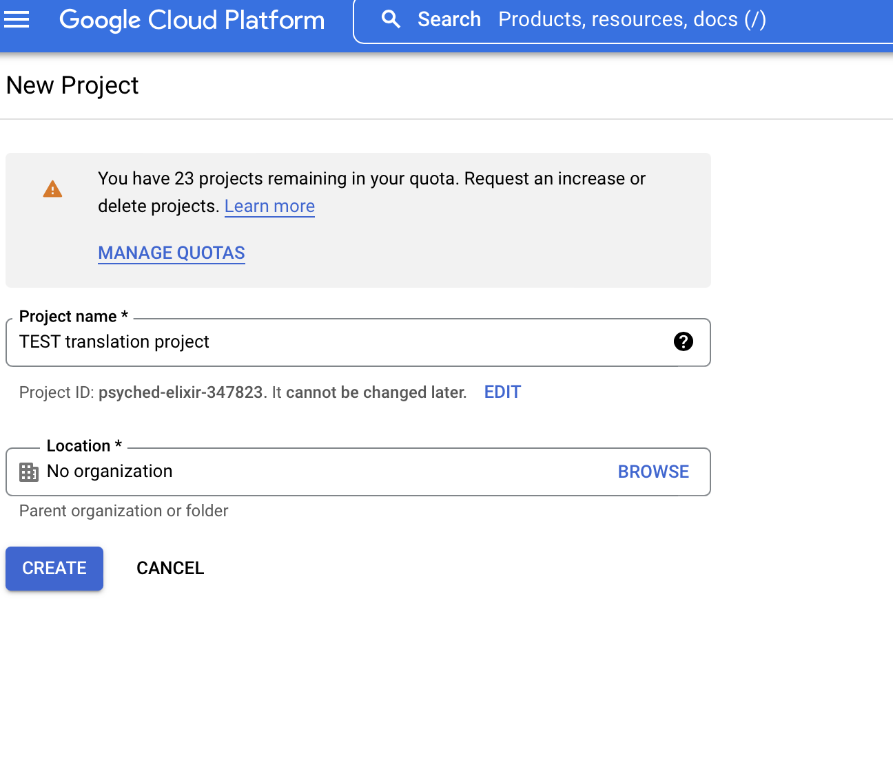

Give your project a title.

The dashboard will automatically update to use your new project, If
not, select your project at the top left.

From here we need to activate the api for language translation.
Select the api tab in the sidebar to the left.

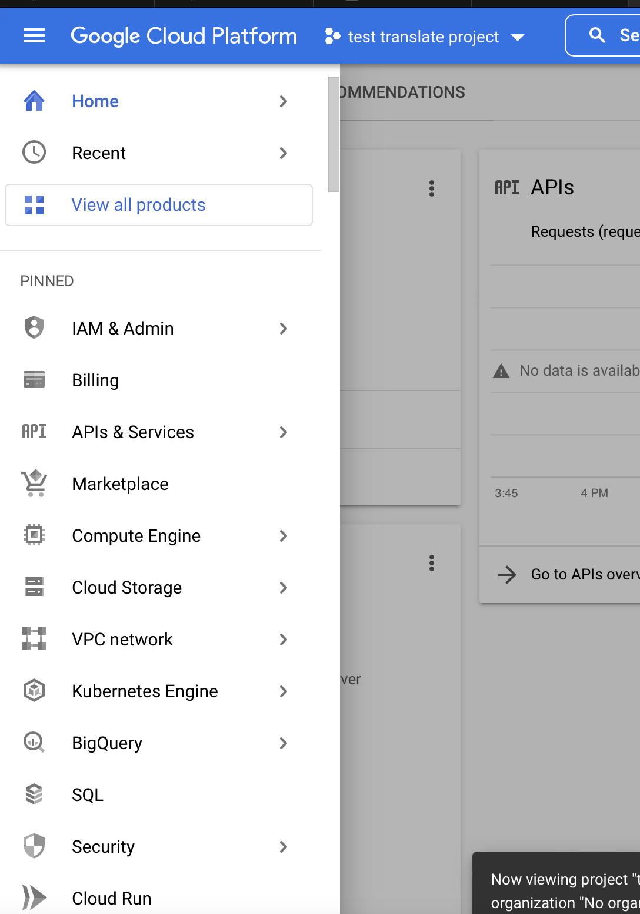


From here you can click the enable apis and services tab at the top

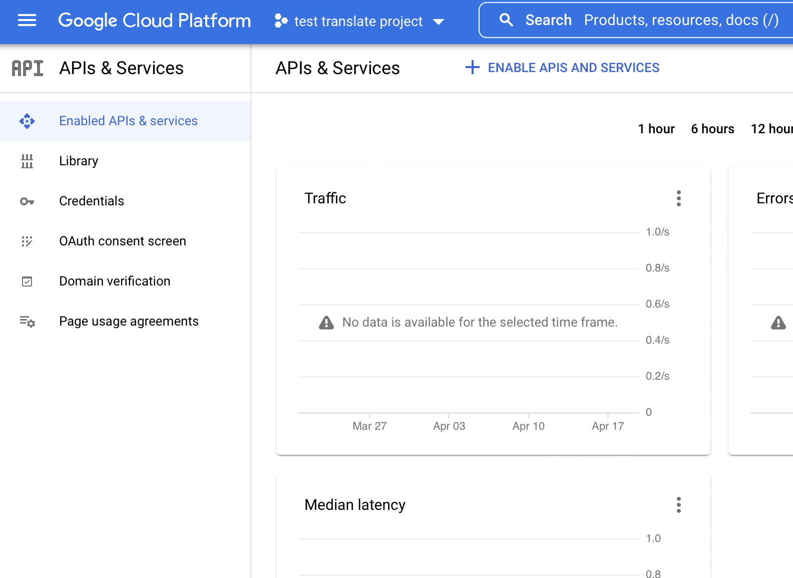


Scroll down to machine learning. Here you will see a cloud translation
api.  Click the api and enable it.

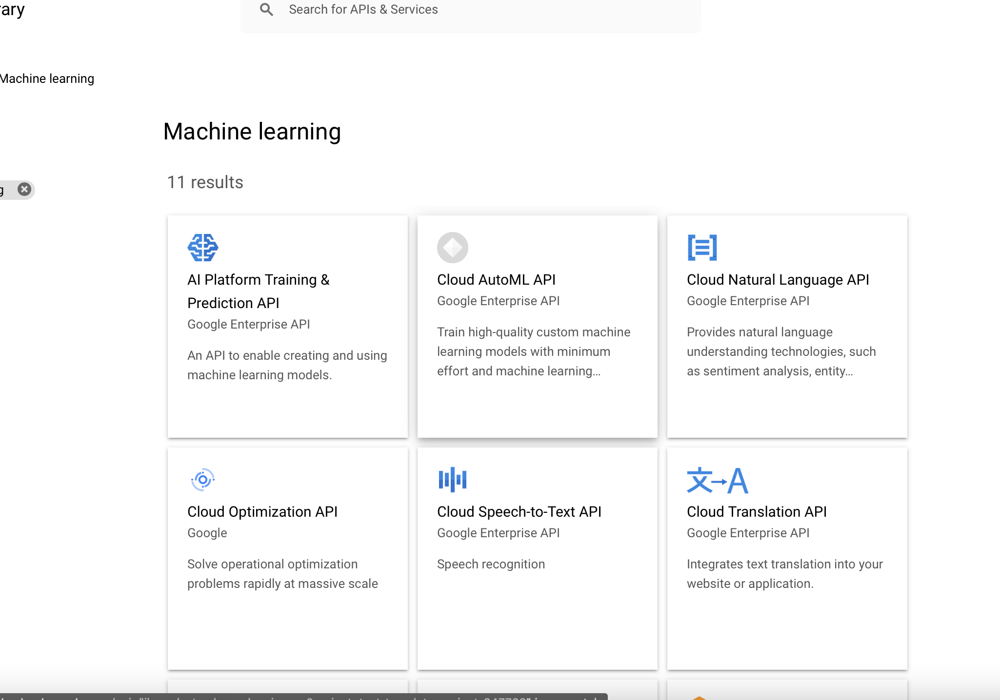


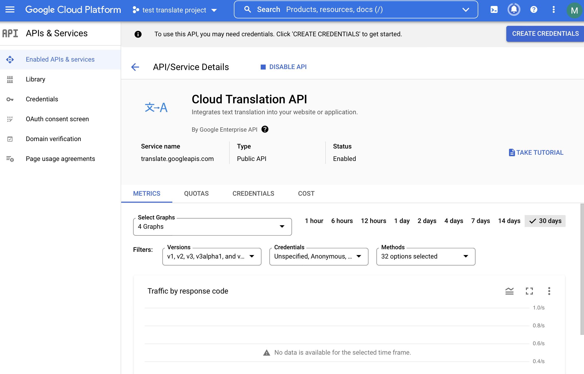

The api is now enabled, and you will see it on your dashboard.

For each project you will have to enable credentials. this is a vital
part to the continuation of the project.

on the tab to the left you will see credentials. here we are going to
click create service account.

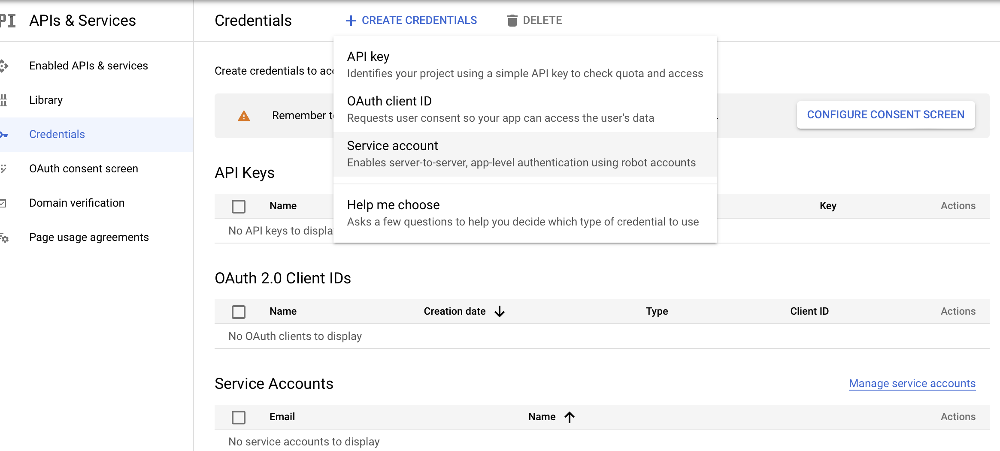

The next step is to title your service account.
You will proceed and click the role owner. 

this step is to decide what role each user has in the terms of the
project. owners typically have access to most resources so we are
going to select that one.


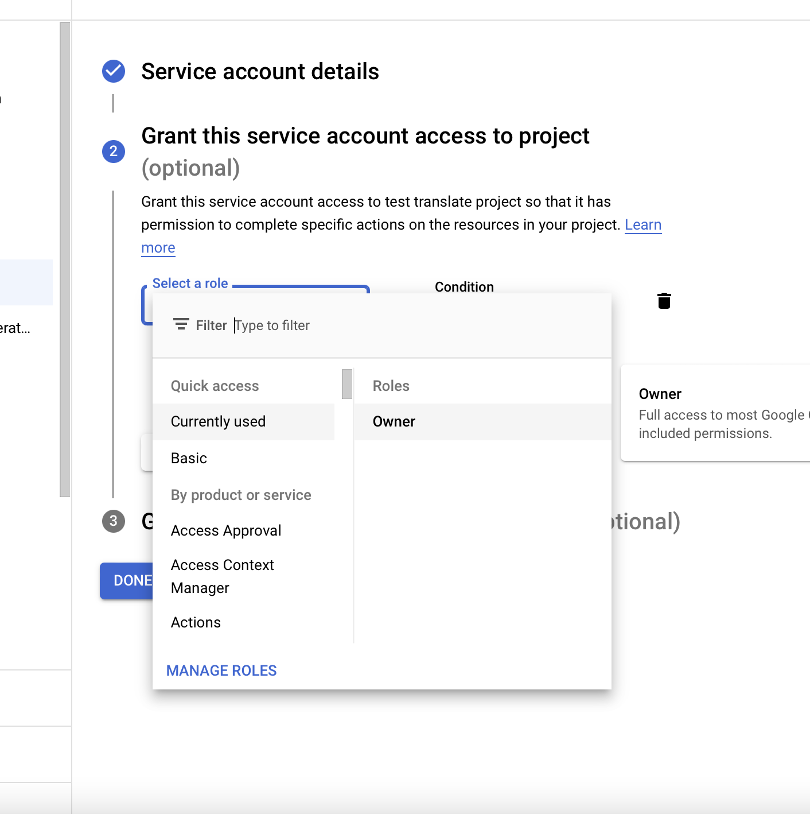

After the creation of the service account you will be prompted to
download the json private key.


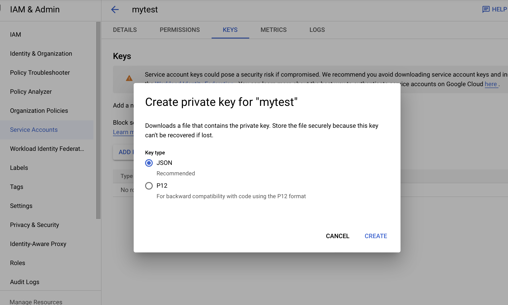

This private key will be placed in your Downloads folder.  it is a
very important piece of information. When creating this private key
make sure to download as a json format.

In the command line you must create a virtual enviroment for the
location of this project

```bash
$ python3.10 -m venv ~/ENV3
$ source ~/ENV3/bin/activate
```

You will need to give this private key a GOOGLE_CREDENTIALS_PATH. This is a very important step.

```bash
$ export GOOGLE_APPLICATION_CREDENTIALS="KEY_PATH"
```

Example:

```bash
export GOOGLE_APPLICATION_CREDENTIALS="/home/user/Downloads/service-account-file.json"
```

In order to use the client library for Natural language translation
you will need to install some packages


```
pip install google-cloud-translate==2.0.1
```

or
```
pip install -r requirments.txt
```


From here you should have a linked api-key with a service account, and
will be ready to use some examples of natural language programming.


An example for a small natural language program is showcased in
[snippets.py](/Users/mysol/cm/cloudmesh-nlp/snippets.py)


## Step 3: CLI Example sing NLP In the Cloudmesh Catalog

Step 1: Use the cloudmesh catalog to start the natural language example.
[Google Natural Language Example](/Users/mysol/cm/cloudmesh-nlp/cloudmesh/nlp/provider/google/translate.py)

Here you will install the catalog first.

On mac

```commandline
python3.10 -m venv ~/ENV3
source ~/ENV3/bin/activate
pip install cloudmesh-installer
cloudmesh-installer -ssh install catalog
```


```commandline
cms help
cms nlp translate --provider=google --from=en --to=de --region=eu-west-1 hello world
```

The output to this command should look like:
```
{'date': '05/02/2022 14:45:45',
 'input': 'hello world',
 'input_language': 'en',
 'output': 'Hallo Welt',
 'output_language': 'de',
 'provider': 'aws',
 'time': 0.2641}
Timer: 0.3864s Load: 0.0004s nlp translate --provider=aws --from=en --to=de --region=eu-west-1 hello world
```


